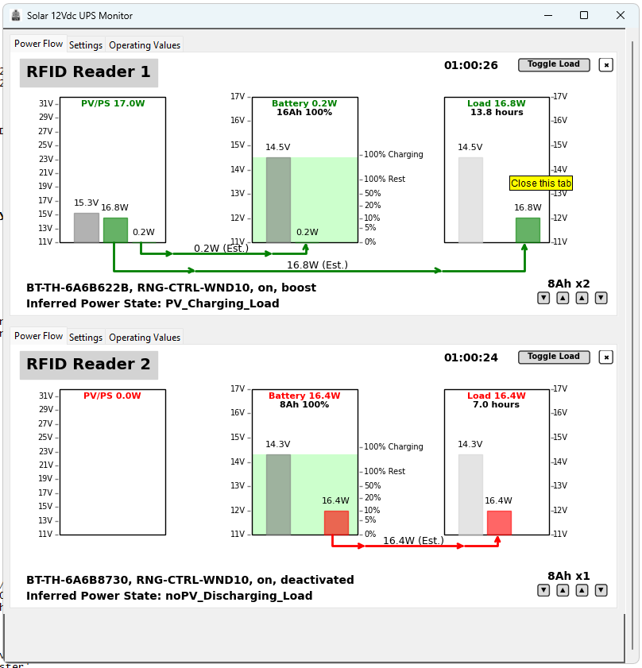
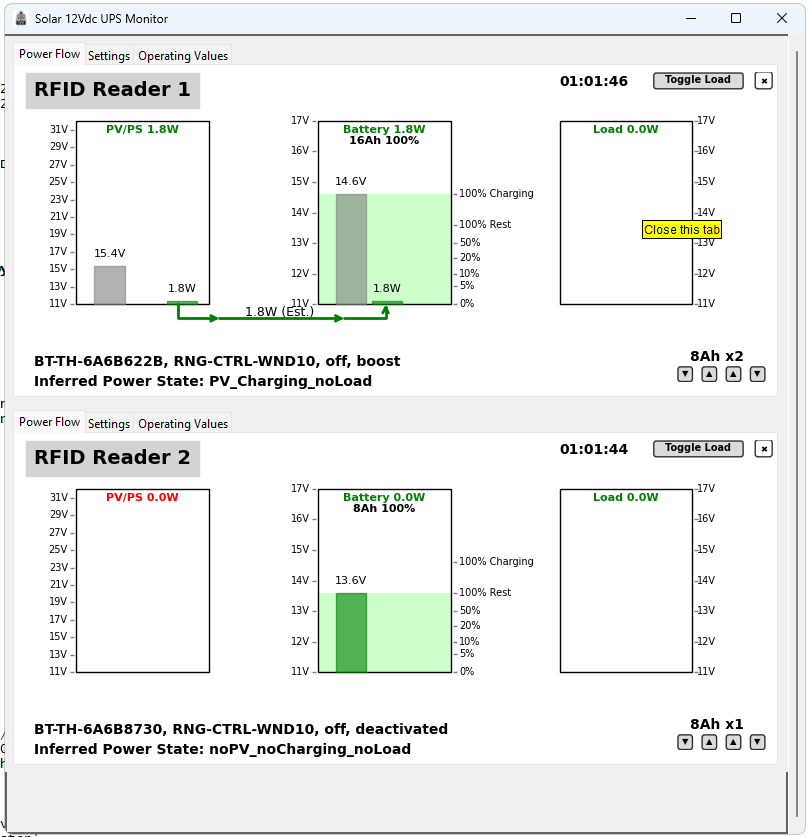
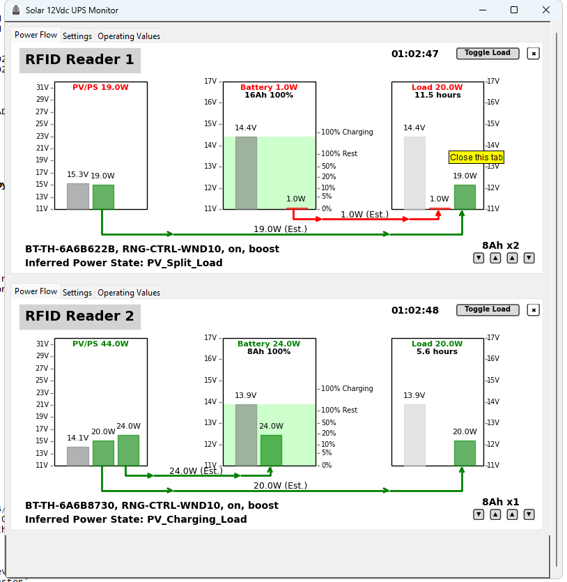

# Solar 12V UPS

The *Solar12VUPS* monitor is a Python TKinter application that monitors the status of one or more 
*Renogy Wanderer 10A PWM Charge Controllers* with the *Renogy BT-1 Bluetooth Module*.

It displays the status of the power source, battery and load. The application can turn the load on and off,
and provide an estimate of the runtime based on the current load and battery state of charge (SoC),

- 
- 
- 


## Use Case

The Solar12VUPS hardware and application was designed to provide a reliable power source for
Low-power devices that can run off 12V or via buck converters at 5V and 24V. 

My specific use case is to monitor the status of multiple 12Vdc UPS implemented with a 
*Renogy Wanderer 10A PWM Charge Controller* and *Eco-Worthy 8Ah LiFePO4 Batteries*.
These are used to power small 12V loads in the 20-40 W range, such as RFID readers, routers,
used to time bike races in locations that power is only available from generators and 
may be intermittent.

My immediate need was to run two boxes of timing equipment at bike races. One box can be
powered from a generator, but using this provides backup if (for example) the generator
runs out of gas. 

The second box typically has no access to 120V power, so it needs to be able to run for
extended time from battery alone, and if the sun is out with help from a 100W solar panel.

The software application provides a display of the current status of the power supply, 
allowing me to swap batteries as needed. 

The typical loads in my application are about 25-35W, can all use 5/12/24 Vdc directly, with no 
requirement for 120V AC power. Removing the need for 120V AC power simplifies the setup and
eliminates the power losses converting from 12Vdc to 120Vac and back to 5/12/24 Vdc as needed
for each device.

### Hardware Requirements
- Must be able to run for 2+ hours on 8Ah battery alone
- Hot-swap batteries (plug new battery in, unplug old battery)
- Can run on PS or PV when available
- Battries can be charged from PS or PV as available

### Software Requirements
- Show current status of PS/PV, Battery and Load
- Estimate runtime based on current load and battery state of charge (SoC)
- Show current flow to/from battery, load, and PS/PV highlight current flow to/from battery as red
- Provide visible feed back when run time drops below an hour

### My current Setup

Box one contains the following, about 32W load when running:
    - Renogy 10A Wanderer PWM Charge Controller and BT-1
    - battery wiring harness that allows 2-3 batteries
    - Eco-Worthy 8Ah LiFePO4 Battery 
    - 70W AC to DC 16-18V Power Supply
    - Impinj R1000 RFID Reader
    - 8 Port Ethernet Switch
    - Cradlepoint IBR600 4G LTE Router

Typically this box is running on the AC to DC power supply, but can run on the battery
if the PS power is unavailable. It has one dedicated 8Ah battery and can be used to 
charge the second boxes alternate battery.

Box two contains the following, about 25W load when running:
    - Renogy 10A Wanderer PWM Charge Controller and BT-1
    - battery wiring harness that allows 2-3 batteries
    - two Eco-Worthy 8Ah LiFePO4 Batteries
    - Impinj R1000 RFID Reader
    - Tp-Link nano router
    - 100W Solar Panel

This box operates in one of two modes:
    - alternating batteries, one battery is in use while the other is charging, typically swap every 1-2 hours
    - running on the solar panel and battery, typically during the day when the sun is out, depending on sun, battery swapping may not be needed

## Hardware

- Renogy 10A Wanderer PWM Charge Controller
- Renogy BT-1 Bluetooth Module
- Eco-Worthy 8Ah LiFePO4 Battery
- 100W Solar Panel (optional)
- 12V DC to 5V DC Buck Converter (optional)
- 12V DC to 24V DC Buck Converter (optional)
- 50-70W AC to DC 16-18V Power Supply (optional)

## Power Supply 
For charging the batteries and for running the main system I use an old laptop power supply.

There are issues WRT to using a laptop power supply, some will turn off when the load is pulls
the voltage too low. YMMV.

There are many power supplies available on Amazon that are designed for charging 12V batteries
and/or for use with "Solar Generators" (e.g. goal zero, etc.). Again YMMV.

## Software

The Windows application is written in Python using tkinter and Bleak. It is designed to find
any and all BT-1 modules, connect to them, and then provide a display showing the current
status of:

- PV/PS - Voltage and current available from the solar panel or power supply
- Battery - Voltage and current being delivered or drawn from the battery
- Load - Voltage and current being delivered to the load from the battery and PV/PS

There are "buttons" to:
- set the battery capacity
- set the number of batteries available
- toggle the load on and off 

The application is designed to just minimize configuration, it will automatically find and connect to
with no user intervention. Setting the battery capacity and number of batteries is the only configuration
that is required to get started and that should be saved to the application settings.

### SOC and Runtime
The application allows for the battery capacity and number of batteries available to be set.
This is used to provide a rough estimate of the runtime for the current load based on the
current battery state of charge (SoC). Currently the application does not differentiate
between battery chemistries, so the SoC is based on the LiFePo4 discharge curve.

### Current Flow
The current flows to and from the battery are estimated based on the current being
delivered by PV/PS and the current being delivered to the load. The charge controller does
not provide this information, so we can only infer it by subtracting the load from the
available power from the PV/PS.

### Removing Charge Controller Display
If a Charge Controller has been in use but is no longer connected, the application
will continue to display the last known values. If you want to remove the Charge Controller
click on the small X in the upper right corner of the Charge Controller display.

### Nickname
You can set a nickname for the Charge Controller. This is stored in the application settings
and will be used the next time the application is run. This allows you to easily identify
multiple Charge Controllers if you have them.

Click on the device name in the upper left corner of the Charge Controller display to set the nickname.


## Limitations

The BT-1 supports a number of different Renogy Charge Controllers but I only have the Wanderer 10A.

The BT-2 module is not currently supported. I don't have one and don't have a Charge Controller compatible with it.
This module has an RJ45 plug uses RS485 to communicate with the charge controller (the BT-1 is RJ12 and RS232).

The Renogy Communication Hub is not currently supported. It is designed to work with the BT-2 and allows for
using a single BT-2 to connect to multiple charge controllers. I don't have one and don't have a Charge Controller compatible with it.

Currently the application does not have settings for battery chemistry, I only have LiFePo4 batteries.

Currently the application will search for all BT-1 modules in range and connect to them. There is no
provision for selecting a specific module to connect to. 


## BT-1 Issues

The BT-1 has some design issues. It does not gracefully handle disconnections and can sometimes
get stuck thinking it is still connected via BLE preventing any new connections. This requires
that the BT-1 be replugged to reset it.

The BT-1 also does not work correctly the first time it is used after being plugged in. The application
needs to timeout waiting for data, then force a disconnect, reconnect, and then it will usually
work correctly.


## GitHub

- [https://github.com/stuartlynne/solar12vups.git](https://github.com/stuartlynne/solar12vups.git)
- [README-Powerstate](README-Powerstate.md)
- [README-Bleak-Linux](README-Bleak-Linux.md)
- [README-BT1](README-BT1.md)
- 

## Desktop Launcher (Linux)

Create a desktop icon and optional menu entry after install:

```bash
# User install (no sudo)
pip install --user .
solar12vups --add-desktop-icon --menu

# System install (sudo)
sudo pip install .
sudo solar12vups --add-desktop-icon --menu

# Desktop-only for current user
solar12vups --add-desktop-icon
```

This writes `~/Desktop/solar12vups.desktop` and, with `--menu`, installs a
`.desktop` entry and icon to user or system paths depending on privileges.
